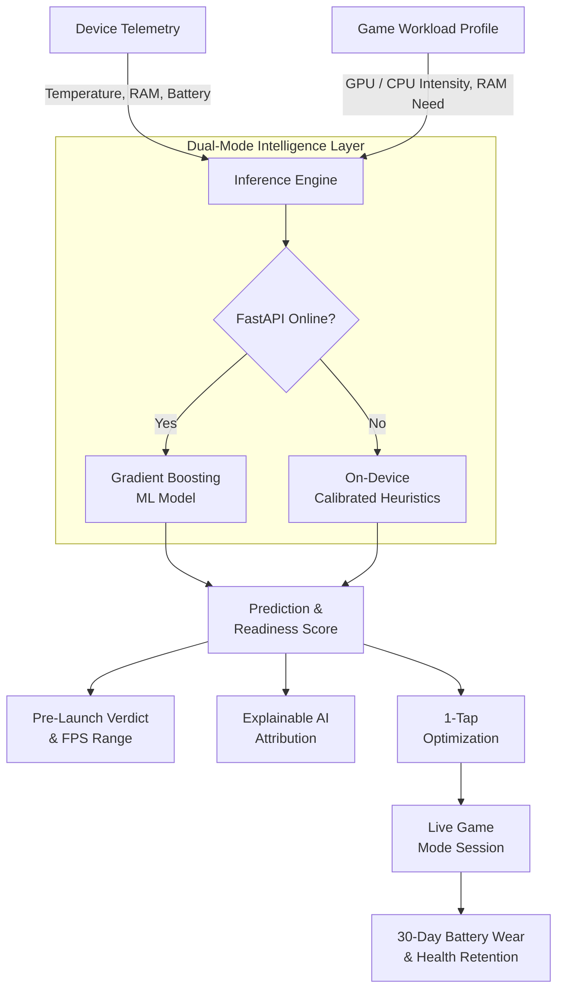

# KATSU — AI Phone Performance Enactor (Caters to iQOO 13 phone)

> An AI-powered predictive performance intelligence system calibrated for modern high-performance smartphones and the **iQOO 13 (Snapdragon® 8 Elite)**.

---

## Problem Statement

Today’s gaming smartphones are powerful, but they still don’t know when they are about to struggle.

Gamers can launch demanding games like Genshin Impact or Honkai: Star Rail without knowing whether their phone is ready for a long, stable session.

As the gaming session continues:

- Heat builds up, causing the phone to throttle and FPS to suddenly drop.
- Gameplay becomes unstable, leading to lag, stuttering, and a poor competitive experience.
- High temperatures and fast charging increase battery stress, but users have no idea which games or usage patterns are contributing to long-term battery wear.
- Existing phone monitors mostly show what is happening right now: CPU usage, temperature, battery level, etc., instead of telling users what is likely to happen next.
  
**The Core Problem**:

Gaming smartphones are powerful enough to handle demanding games, but users have no intelligent way to know how long their phone can sustain that performance before overheating, throttling, or draining the battery.

What if your phone could predict the problem before it happened and tell you what to do about it?

---

## Our Solution

**KATSU** shifts mobile performance management from **reactive monitoring** to **predictive intelligence**:

1. **Pre-Launch Prediction**: Analyzes target game workload specifications against real-time hardware telemetry to forecast frame rates, thermal headroom, and memory margins before starting.
2. **Actionable Pre-Game Optimization**: Provides estimated frame rate gains and one-tap background resource cleanup ("Optimize For Me") to ensure optimal headroom.
3. **Live Game Mode Monitoring**: Delivers a real-time frame rate stream, 1% low metrics, and dynamic thermal differential tracking.
4. **Post-Usage Degradation Intelligence**: Tracks 30-day battery health retention, attributes hardware wear on a per-app basis, and provides AI-generated mitigation recommendations.

---

## Key Features

### 1. Game Readiness Score
Analyzes **temperature, RAM, battery and hardware state** to generate a **0 to 100 readiness score** and predicted FPS range before gameplay.

### 2. One Tap Optimization
Identifies resource intensive background processes and provides **instant optimization** to create additional performance headroom.

### 3. Explainable AI
Shows **why the prediction was made**, highlighting the impact of temperature, RAM, GPU capability and other hardware factors.

### 4. Live Performance Monitoring
Tracks **FPS, 1% lows, temperature and session duration** in real time to detect performance degradation.

### 5. Thermal Risk Prediction
Identifies when the device is approaching a **thermal throttling zone**, helping prevent sudden FPS drops and stuttering.

### 6. Battery Wear Intelligence
Tracks gaming patterns over time and estimates **battery stress and health retention**, including per game impact.

### 7. Universal Game Analyzer
Provides pre calibrated profiles for popular games and allows users to **analyze unlisted games** based on workload intensity.

### 8. AI Performance Briefing
Converts important performance insights into **simple spoken recommendations** for hands free monitoring.

### 9. Dual Mode Intelligence
Uses **ML powered predictions when connected** and calibrated on device heuristics when the backend is unavailable.

### 10. Platform Ready Architecture
Initially optimized for the **iQOO 13 with Snapdragon® 8 Elite**, with an architecture designed for future multi device and multi SoC support.

## Core Differentiator

**Traditional tools show what is happening. KATSU predicts what is about to happen and recommends what to do.**

---

## Tech Stack

| Category | Technology | Purpose |
|---|---|---|
| **Frontend** | **HTML5 & CSS3** | Responsive UI and KATSU design system |
| | **Vanilla JavaScript (ES6+)** | Application logic, API communication and real-time updates |
| | **SVG** | Live FPS and battery health visualizations |
| | **Web Speech API** | Voice-based performance alerts |
| **Backend** | **Python 3.10+** | Core backend and ML runtime |
| | **FastAPI** | REST API for predictions, health checks and game profiles |
| **Machine Learning** | **scikit-learn** | Model training and performance prediction |
| | **Gradient Boosting Regressor** | Predicts performance score and expected FPS |
| | **Random Forest Classifier** | Predicts thermal throttling and battery impact |
| **Data & Models** | **NumPy** | Numerical computations and data processing |
| | **Joblib** | ML model serialization and deployment |
| **Server** | **Node.js** | Lightweight frontend server |

---

## Architecture & Workflow



1. **Telemetry Ingestion**: Gathers battery level, memory utilization, storage headspace, and surface temperature.
2. **Workload Parameterization**: Extracts game demands (RAM requirement, target refresh rate, GPU load factor).
3. **Inference Execution**: Queries the FastAPI ML backend or executes local mathematical modeling.
4. **Insight Delivery**: Displays the verdict, frame rate expectations, feature attribution, and optimization options.
5. **Session Monitoring & Wear Tracking**: Streams live gameplay telemetry and logs cumulative battery wear.

---

## Future Implementations

* **On-Device AI Explanation Layer**: Integrate a lightweight local LLM to analyze device telemetry and game workload data, generating personalized explanations and recommendations in simple language.

* **Direct Android Hardware Integration**: Connect KATSU to Android thermal, battery and system interfaces for continuous real-device telemetry without relying on simulated inputs.

* **Adaptive In-Game Optimization**: Automatically adjust resolution, refresh rate and performance settings when thermal or performance risks are detected.

* **Intelligent Bypass Charging**: Automatically trigger battery bypass charging during high-load gaming sessions to reduce unnecessary battery stress.

* **Personalized & Interactive Device Learning**: Continuously learn from each phone's usage history, age, thermal behavior and gaming patterns to make predictions increasingly specific to that device.

* **Beyond Gaming**: Expand the same predictive intelligence framework to demanding workloads such as video editing, AI applications and other performance-intensive tasks.


---

## Presentation & Media Links

### YouTube Demo Video
<!-- Paste your YouTube video link below -->
[Watch the Demo Video](https://www.youtube.com/)

### Presentation / Pitch Deck (Google Drive)
<!-- Paste your Google Drive pitch deck link below -->
[View Pitch Deck on Google Drive](https://drive.google.com/)

---

## Quickstart Guide

### 1. Start the Machine Learning Backend
```bash
# Navigate to repository root
pip install -r backend/requirements.txt

# Launch FastAPI server
uvicorn backend.main:app --host 127.0.0.1 --port 8000
```
* API Documentation: `http://127.0.0.1:8000/docs`
* Health Check: `http://127.0.0.1:8000/health`

### 2. Launch the Web Application
```bash
# Run the local static server
node serve.js
```
Open your browser and navigate to:
👉 **`http://localhost:3000`**


###PROTOTYPE IMAGES


